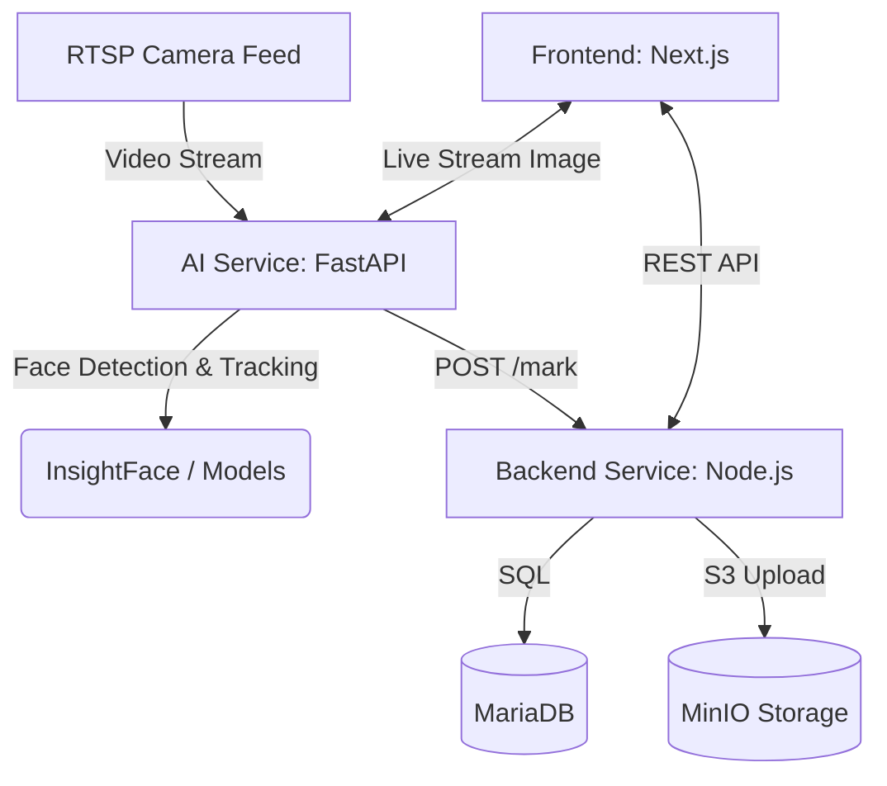

# DEEP RESEARCH AUDIT — CCTV Face-Recognition Attendance System

## 1. Executive Summary
- **Single Point of Failure Confirmation**: The application heavily relies on a single-node setup via Docker Compose on a single PC. If this machine goes offline, the entire platform (DB, Backend, AI, UI) becomes unavailable.
- **Frontend Offline Vulnerability**: Next.js lacks a read-only cache of essential schedule data. The Service Worker caches assets, and IndexedDB queues mutation requests (OfflineQueueService), but the user cannot view cached dashboard data if the Node backend is unreachable.
- **Missing Viewport Tag**: The Next.js `layout.tsx` is completely missing the `<meta name="viewport" content="width=device-width, initial-scale=1" />` tag. This causes catastrophic rendering issues on mobile, breaking otherwise responsive Tailwind classes.
- **Backend "God Files"**: Several backend routes (e.g., `adminRoutes.js` at 1700+ lines, `authRoutes.js`, `studentRoutes.js`) contain significant amounts of business logic that should be refactored into modular services.
- **AI Service Optimization**: The RTSP capture runs via `asyncio` and `cv2` within a single FastAPI app. It is functional but tight coupling between bounding box tracking and the `video_feed` endpoint could become a bottleneck if scaling cameras.
- **Orphaned Files Detected**: We discovered standalone test scripts and disconnected React components that are not imported anywhere, indicating incomplete cleanup during development.

## 2. Project Structure & Organization Findings
- **Frontend (`/frontend`)**: Standard Next.js 14 App Router layout.
  - **Inconsistency**: The `components/` directory is overly flat. Massive domain-specific components (e.g., `SessionModal.tsx` at 82k bytes / ~1500 lines) sit alongside generic UI buttons.
- **Backend (`/backend`)**: Node.js / Express.
  - **Anti-pattern**: Severe "God files" in the `/routes` folder. Routes shouldn't hold SQL queries and complex data wrangling. Business logic is inconsistently split between `routes/` and `services/`.
- **AI Service (`/ai-service`)**: Python / FastAPI.
  - Logic is well-separated into `core/` (vision logic), `models/` (ML logic), and `services/` (analytics).
  - RTSP ingestion logic is coupled directly into `main.py` rather than a dedicated ingestion service.

## 3. Unused-File Table

| File | Referenced By | Verdict | Notes |
|------|---------------|---------|-------|
| `backend/services/test_ocr_logic.js` | None | Likely Unused | Standalone script for testing OCR logic, not imported or part of standard flow |
| `frontend/components/DeveloperCredits.tsx` | None | Likely Unused | Component not imported or routed in the application anywhere |
| `ai-service/download_models.py` | Dockerfile/deploy scripts | Used | Standalone script executed during docker build to pre-fetch ML models |
| `backend/scripts/seed_analytics.js` | None | Likely Unused | Standalone database seeding script, not imported into app code |
| `backend/scripts/scratch_audit.js` | None | Likely Unused | Standalone utility script |
| `backend/scripts/apply_batch_updates.js` | None | Likely Unused | Standalone utility script for batch updates |

## 4. Architecture Deep Dive

**Data Flow**:
1. **Camera Capture**: RTSP streams are ingested via OpenCV in `ai-service/main.py`.
2. **Face Detection & Recognition**: Bounding boxes are generated and fed into InsightFace (`face_recognition.py`) and matched against cached embeddings.
3. **Attendance Record Creation**: `attendance_logic.py` uses movement trends (area sizing) to detect ENTRY/EXIT, triggering HTTP POST to Node backend (`/api/attendance/mark`).
4. **Storage**: Images are pushed to MinIO; records to MariaDB.
5. **Retrieval**: Node backend serves this data to the Next.js frontend.

**Deployment Context**:
Based on `docker-compose.yml`, the application targets a single-node deployment (all containers on one machine). This makes the host PC a severe **Single Point of Failure**.



## 5. AGENTS.md Status
No existing AI agent instruction files (`AGENTS.md`, `CLAUDE.md`, or `.cursorrules`) were found. I have generated a comprehensive `AGENTS.md` at the root of the repository outlining the project architecture, deployment constraints, coding conventions, and known gotchas.

## 6. Server-Downtime Resilience Findings & Proposal

**Current Behavior**:
- The Next.js frontend has a service worker (`sw.js`) that precaches core assets and shows an `offline.html` page when offline.
- Mutations are queued via `OfflineQueueService` (IndexedDB).
- **Critical Flaw**: Because the Database and Backend API run on the exact same local PC as the CCTV AI service, a power outage in the classroom takes the entire website offline. The frontend cache cannot serve schedule or historical data if the user refreshes.

**Proposed Solution: Zero-Cost Cloud-Hybrid Architecture**
To achieve high availability while keeping the heavy video processing local (and keeping server costs at $0), the system must be split using free-tier providers:
1. **Cloud Web Layer (24/7 Uptime, Free)**: Migrate the Next.js Frontend to **Vercel**, the Node.js Backend to **Render** or **Koyeb**, the MariaDB to **Aiven's free tier**, and MinIO storage to **Cloudflare R2**. This ensures that students and professors can log in and view analytics from anywhere, at any time, regardless of the classroom PC's status, with zero recurring costs.
2. **Local Edge Node (AI Service)**: Keep the Python FastAPI `ai-service` running on the physical classroom PC. This node pulls the RTSP camera feed locally (saving massive bandwidth costs) and POSTs lightweight recognition hits up to the Cloud Backend.
3. **Graceful Degradation**: Update the `SessionModal.tsx` in the frontend so that when a professor attempts to start a class, it checks the health of the local AI node (either directly or via a cloud proxy). If the classroom PC is down, the frontend remains fully usable but disables the "Start Live CCTV Session" button, falling back to manual attendance.

*(A detailed step-by-step migration path is now available in `CLOUD_MIGRATION_GUIDE.md` and a specific edge-deployment file `docker-compose.local-ai.yml` has been created).*

## 7. Mobile UI Audit Findings

1. **CRITICAL: Missing Viewport Tag**. The Next.js `app/layout.tsx` is missing `<meta name="viewport" content="width=device-width, initial-scale=1" />`. This breaks all Tailwind responsive scaling on mobile devices. (Line 1 of `layout.tsx`).
2. **`SessionModal.tsx` Overflow**. The modal attempts to use massive absolute widths and complex padding that does not collapse gracefully on 375px viewports. The horizontal input layouts for "Schedule & Notify" wrap poorly.
3. **`ClassAnalytics.tsx` and `ClassDetailsModal.tsx` Tables**. The data tables are wrapped in `overflow-x-auto`, which is functionally okay but creates a cramped scroll experience on 375px-430px screens due to padding restrictions.
4. **Touch Targets**. Several buttons in `ClassDetailsModal.tsx` use `py-1.5` resulting in heights below the 44px iOS HIG recommendation.

## 8. Prioritized Recommendations

1. **Add Viewport Meta Tag**: Immediately insert the standard viewport meta tag in `frontend/app/layout.tsx`.
2. **Refactor Backend "God Files"**: Migrate the heavy SQL and business logic from `adminRoutes.js` and `authRoutes.js` into dedicated service files (e.g., `adminService.js`) to decouple routing from data access.
3. **Implement Read-Only Dashboard Cache**: Extend the existing `offlineDB.ts` (or introduce React Query) to store GET request payloads for the dashboard and schedule screens, fulfilling the offline resilience requirement.
4. **Block Offline Session Starts**: Add explicit health-check guards in `SessionModal.tsx` to prevent users from starting sessions when the `ai-service` or backend is unreachable.
5. **Component Consolidation**: Break down `SessionModal.tsx` (~1500 lines) into smaller, manageable subcomponents (e.g., `SessionScheduler`, `SessionImmediateStart`).
6. **Remove Orphaned Scripts**: Delete `backend/services/test_ocr_logic.js`, `frontend/components/DeveloperCredits.tsx`, and scratch pad scripts in `backend/scripts/` to clean the repository.

## Appendix: Full Recursive File Tree
```
.
├── AGENTS.md
├── AUDIT_REPORT.md
├── CLOUD_MIGRATION_GUIDE.md
├── PRODUCTION_MIGRATION.md
├── ai-service
│   ├── Dockerfile
│   ├── ai-base.Dockerfile
│   ├── core
│   │   ├── attendance_logic.py
│   │   ├── face_enhancer.py
│   │   ├── face_recognition.py
│   │   └── face_tracker.py
│   ├── download_models.py
│   ├── fetch_models.sh
│   ├── main.py
│   ├── models
│   │   ├── active_liveness.py
│   │   ├── depth_liveness.py
│   │   ├── facenet_mobile.py
│   │   └── passive_liveness.py
│   ├── pyrightconfig.json
│   ├── requirements.txt
│   ├── routes
│   │   └── face_routes.py
│   ├── services
│   │   ├── chatbot.py
│   │   └── predictive_analytics.py
│   └── utils
│       ├── cache.py
│       └── error_handler.py
├── backend
│   ├── Dockerfile
│   ├── apply_batch_updates.js
│   ├── config
│   │   ├── db.js
│   │   └── holidays.js
│   ├── eng.traineddata
│   ├── index.js
│   ├── init.sql
│   ├── middleware
│   │   ├── auth.js
│   │   ├── errorHandler.js
│   │   ├── inputValidation.js
│   │   └── securityMiddleware.js
│   ├── package-lock.json
│   ├── package.json
│   ├── routes
│   │   ├── adminRoutes.js
│   │   ├── aiRoutes.js
│   │   ├── analyticsRoutes.js
│   │   ├── attendanceRoutes.js
│   │   ├── attendanceWarningRoutes.js
│   │   ├── authRoutes.js
│   │   ├── classRoutes.js
│   │   ├── consentRoutes.js
│   │   ├── dataRightsRoutes.js
│   │   ├── groupRoutes.js
│   │   ├── notificationRoutes.js
│   │   ├── publicRoutes.js
│   │   ├── studentRoutes.js
│   │   └── userRoutes.js
│   ├── scratch_audit.js
│   ├── scripts
│   │   ├── recover_biometrics.js
│   │   └── sync_user_periods.js
│   ├── seed_analytics.js
│   ├── services
│   │   ├── aiService.js
│   │   ├── analyticsService.js
│   │   ├── attendanceWarningService.js
│   │   ├── monitoringService.js
│   │   ├── ocrService.js
│   │   ├── reportingService.js
│   │   ├── test_ocr_logic.js
│   │   └── verificationService.js
│   └── utils
│       ├── emailService.js
│       ├── faceValidation.js
│       ├── minioHelper.js
│       ├── notificationHelper.js
│       └── passwordValidator.js
├── backups
│   └── heritage_ui_backup
│       ├── app
│       │   ├── login
│       │   │   └── page.tsx
│       │   ├── page.tsx
│       │   └── register
│       │       ├── professor
│       │       │   └── page.tsx
│       │       └── student
│       │           └── page.tsx
│       ├── globals.css
│       └── tailwind.config.ts
├── brain
│   └── check_time.js
├── deploy.sh
├── docker-compose.dev.yml
├── docker-compose.local-ai.yml
├── docker-compose.yml
├── frontend
│   ├── Dockerfile
│   ├── README.md
│   ├── app
│   │   ├── Providers.tsx
│   │   ├── admin
│   │   │   ├── ai-analytics
│   │   │   │   └── page.tsx
│   │   │   ├── analytics
│   │   │   │   └── page.tsx
│   │   │   ├── camera-test
│   │   │   │   └── page.tsx
│   │   │   ├── dashboard
│   │   │   │   └── page.tsx
│   │   │   ├── layout.tsx
│   │   │   ├── login
│   │   │   │   └── page.tsx
│   │   │   └── profile
│   │   │       ├── layout.tsx
│   │   │       └── page.tsx
│   │   ├── forgot-password
│   │   │   └── page.tsx
│   │   ├── globals.css
│   │   ├── layout.tsx
│   │   ├── login
│   │   │   ├── layout.tsx
│   │   │   └── page.tsx
│   │   ├── not-found.tsx
│   │   ├── notifications
│   │   │   └── page.tsx
│   │   ├── page.tsx
│   │   ├── privacy-policy
│   │   │   └── page.tsx
│   │   ├── professor
│   │   │   ├── ai-analytics
│   │   │   │   └── page.tsx
│   │   │   ├── camera-test
│   │   │   │   └── page.tsx
│   │   │   ├── dashboard
│   │   │   │   ├── page.tsx
│   │   │   │   └── tabs
│   │   │   │       ├── ActiveSessionPanel.tsx
│   │   │   │       ├── AnalyticsTab.tsx
│   │   │   │       ├── ClassesTab.tsx
│   │   │   │       ├── HomeTab.tsx
│   │   │   │       ├── MonitorTab.tsx
│   │   │   │       └── ScheduleTab.tsx
│   │   │   ├── layout.tsx
│   │   │   └── profile
│   │   │       ├── layout.tsx
│   │   │       └── page.tsx
│   │   ├── register
│   │   │   ├── professor
│   │   │   │   └── page.tsx
│   │   │   └── student
│   │   │       └── page.tsx
│   │   └── student
│   │       ├── ai-insights
│   │       │   └── page.tsx
│   │       ├── classes
│   │       │   └── [id]
│   │       │       └── page.tsx
│   │       ├── dashboard
│   │       │   ├── page.tsx
│   │       │   └── tabs
│   │       │       ├── AnalyticsTab.tsx
│   │       │       ├── AttendanceTab.tsx
│   │       │       ├── ClassesTab.tsx
│   │       │       ├── HomeTab.tsx
│   │       │       └── ScheduleTab.tsx
│   │       ├── layout.tsx
│   │       └── profile
│   │           ├── layout.tsx
│   │           └── page.tsx
│   ├── apply_footer_and_jargon.py
│   ├── check_braces.py
│   ├── components
│   │   ├── AcademicSettingsTab.tsx
│   │   ├── AcademicUpdateBanner.tsx
│   │   ├── AttendanceInsights.tsx
│   │   ├── AttendanceInsightsSkeleton.tsx
│   │   ├── AuthGuard.tsx
│   │   ├── Breadcrumbs.tsx
│   │   ├── BulkActions.tsx
│   │   ├── CancelSessionModal.tsx
│   │   ├── ClassAnalytics.tsx
│   │   ├── ClassDetailsModal.tsx
│   │   ├── ConditionalFooter.tsx
│   │   ├── ConfirmModal.tsx
│   │   ├── ConsentGuard.tsx
│   │   ├── ConsentStep.tsx
│   │   ├── CreateClassModal.tsx
│   │   ├── CreateProfessorModal.tsx
│   │   ├── DataPrivacyConsent.tsx
│   │   ├── DeletionRequestsTab.tsx
│   │   ├── DeveloperCredits.tsx
│   │   ├── EditClassModal.tsx
│   │   ├── FaceEnrollmentScanner.tsx
│   │   ├── FaceReScan.tsx
│   │   ├── IdentityBackground.tsx
│   │   ├── IdentityFooter.tsx
│   │   ├── LiveCCTVPreview.tsx
│   │   ├── LivenessCapture.tsx
│   │   ├── Navbar.tsx
│   │   ├── NotificationCenter.tsx
│   │   ├── Personalization.tsx
│   │   ├── SessionModal.tsx
│   │   ├── SessionTimeout.tsx
│   │   ├── SmartSearch.tsx
│   │   ├── StudentBatchModal.tsx
│   │   ├── TermsAndConditions.tsx
│   │   ├── ThemeProvider.tsx
│   │   ├── ThemeToggle.tsx
│   │   ├── Toast.tsx
│   │   ├── UpdateManager.tsx
│   │   ├── VideoFeed.tsx
│   │   ├── charts
│   │   │   └── AttendanceChart.tsx
│   │   ├── modals
│   │   │   └── IdentityTheftModal.tsx
│   │   └── ui
│   │       ├── BackButton.tsx
│   │       ├── Breadcrumbs.tsx
│   │       ├── Button.tsx
│   │       ├── DashboardTabs.tsx
│   │       ├── EmptyState.tsx
│   │       ├── InputField.tsx
│   │       └── Skeleton.tsx
│   ├── context
│   │   └── NavigationContext.tsx
│   ├── execute_final_jargon_fixes.py
│   ├── extract_jargon.py
│   ├── extract_remaining_jargon.py
│   ├── final_clean.py
│   ├── fix_all_jargon.py
│   ├── fix_buttons.py
│   ├── hooks
│   │   └── useConsent.ts
│   ├── jargon.json
│   ├── jargon_report.txt
│   ├── lib
│   │   ├── background-removal.ts
│   │   └── offline.ts
│   ├── next.config.mjs
│   ├── package-lock.json
│   ├── package.json
│   ├── postcss.config.js
│   ├── public
│   │   ├── feedback-qr.png
│   │   ├── logo.png
│   │   ├── offline.html
│   │   ├── output.css
│   │   ├── pup-pylon-day.jpg
│   │   ├── pup-pylon-night.jpg
│   │   ├── sw.js
│   │   └── version.txt
│   ├── remaining_jargon.json
│   ├── restrict_footer_further.py
│   ├── revert_labels.py
│   ├── services
│   │   ├── offlineQueueService.ts
│   │   └── syncManager.ts
│   ├── tailwind.config.ts
│   ├── tsconfig.json
│   └── utils
│       ├── auth.ts
│       ├── holidays.ts
│       ├── offlineDB.ts
│       └── version.ts
├── full_tree.txt
├── local-only.sh
├── nginx
│   ├── Dockerfile
│   └── nginx.conf
├── pyrightconfig.json
└── walkthrough_v3.md

62 directories, 215 files

```
